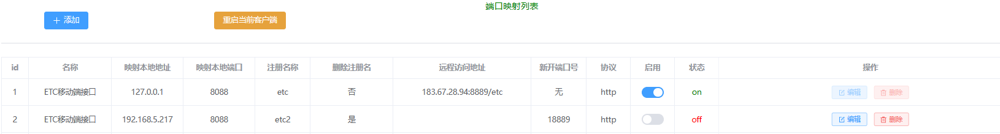
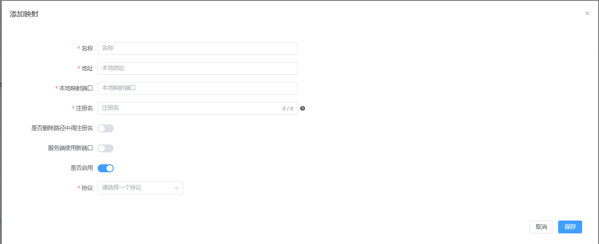

### http 内网穿透工具

       

***通过公网服务器将内网http服务映射到公网，可实现服务端通过统一端口，根据注册名称路由到各客户端，也可实现服务端动态创建http服务与客户端注册服务一一映射
***

* 使用方式

> 1、服务端-部署在公网服务器

```properties
#启动服务类型
http.pierce.boot-type=server

#服务端与客户端通信端口
http.pierce.server.transfer-port=8082
#服务端默认http服务端口
http.pierce.server.http-server-port=8081
#服务端监听ip地址
http.pierce.server.address=0.0.0.0
#是否开启日志
http.pierce.server.logger=false
#服务端验证key
http.pierce.server.token=123456
#心跳包检测间隔 单位s
http.pierce.server.timeout=30s
http.pierce.server.keep-time-out=120s
http.pierce.server.http-object-size=5MB
http.pierce.server.max-frame-length=5MB
```

***<font color=red>配置src/main/resources/web.setting</font>***

```properties
server.type = none
```

> 2、客户端端-部署在内网服务器

```properties
#启动服务类型
http.pierce.boot-type=client
#本地管理端口
server.port=8088

#客户端连接服务端配置
#是否开启日志
http.pierce.client.logger=false
#服务端ip地址
http.pierce.client.server-address=127.0.0.1
#服务端端口
http.pierce.client.server-port=8082
#心跳包发送间隔 单位s
http.pierce.client.timeout=30s
#服务端验证key
http.pierce.client.token=123456
#服务断开重试间隔 单位s
http.pierce.client.retry-time=30s
http.pierce.client.max-frame-length=5MB
```

***<font color=red>配置src/main/resources/web.setting</font>***

```properties
server.type = web
```

> 3、打开本地管理ui界面(http://127.0.0.1:8088/index.html)

